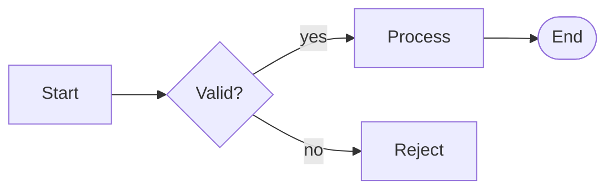
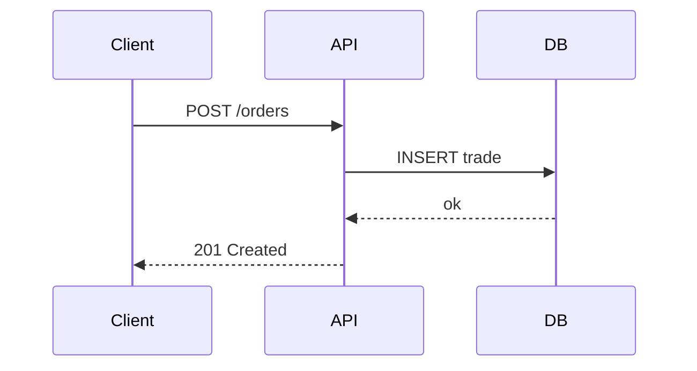
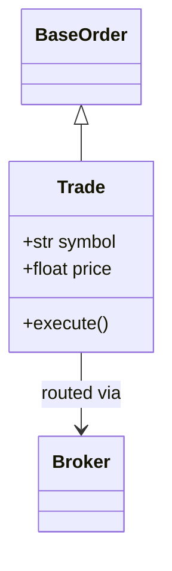
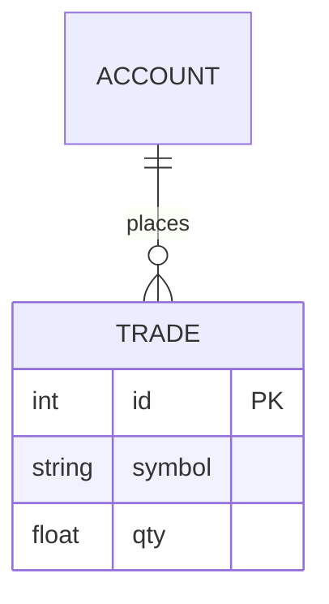
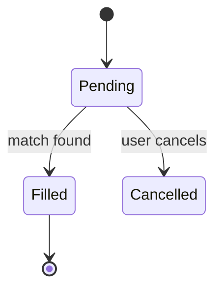
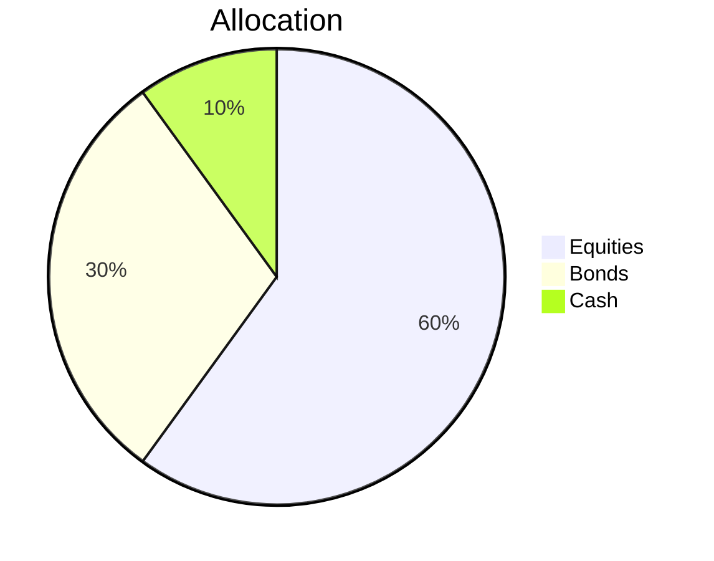

# Mermaid

Text-based diagrams that render inside Markdown. Write a fenced code block with `mermaid` as the language tag — GitHub, MkDocs Material, VS Code, and [mermaid.live](https://mermaid.live) all render it.

---

## Flowchart

````markdown

````

Direction: `LR` left-right, `TD` top-down, `RL`, `BT`.

Node shapes: `[rect]` `(rounded)` `([pill])` `{diamond}` `((circle))` `[(cylinder)]`

Edge types:
```
A --> B           arrow
A -- label --> B  labelled
A -.-> B          dotted
A ==> B           thick
```

Subgraphs:
```
subgraph name
    A --> B
end
```

---

## Sequence diagram

````markdown

````

`->>` solid arrow, `-->>` dotted. Add `Note over A,B: text` or `rect rgb(...)` blocks for grouping.

---

## Class diagram

````markdown

````

Relationships:

| Syntax | Meaning |
|---|---|
| `A <\|-- B` | inheritance (B extends A) |
| `A <\|.. B` | implementation (B implements A / Protocol) |
| `A --> B` | association (A uses B) |
| `A *-- B` | composition (A owns B, B can't exist alone) |
| `A o-- B` | aggregation (A contains B weakly) |

Visibility: `+` public, `-` private, `#` protected.

---

## ER diagram

````markdown

````

Cardinality: `||` exactly one, `o|` zero-or-one, `}|` one-or-more, `}o` zero-or-more.

---

## State diagram

````markdown

````

---

## Pie chart

````markdown

````

---

## Tips

- Wrap labels with special chars in quotes: `A["label (note)"]`.
- Comments: `%% text`.
- Theme override: `%%{init: {"theme": "dark"}}%%` at the top of the block.

!!! tip "Quick iteration"
    Paste any block into [mermaid.live](https://mermaid.live) for instant preview without a local renderer.
